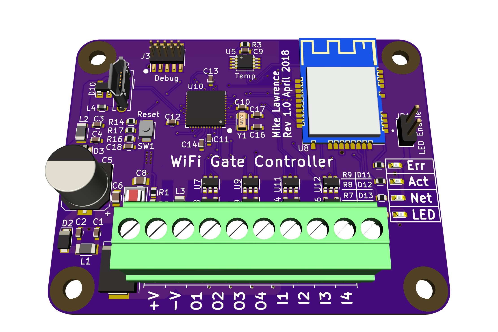
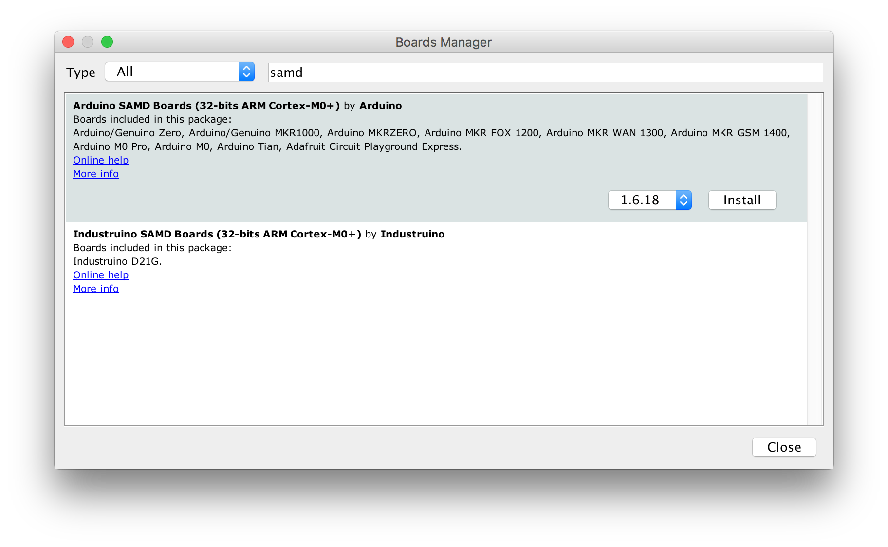
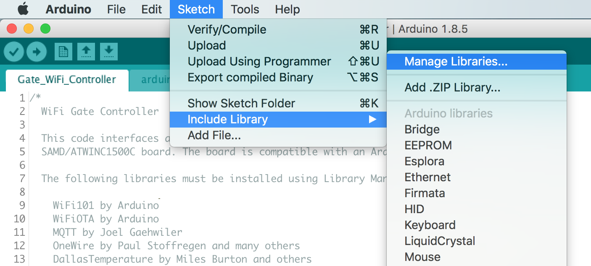
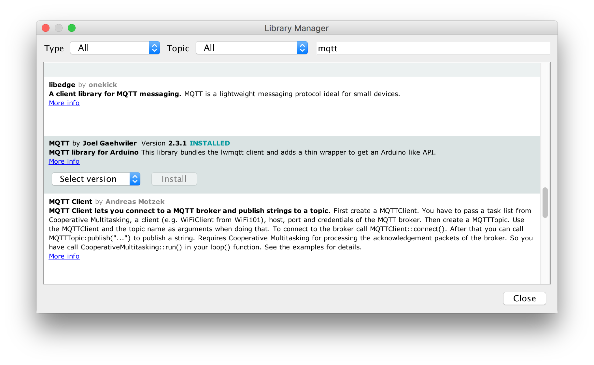
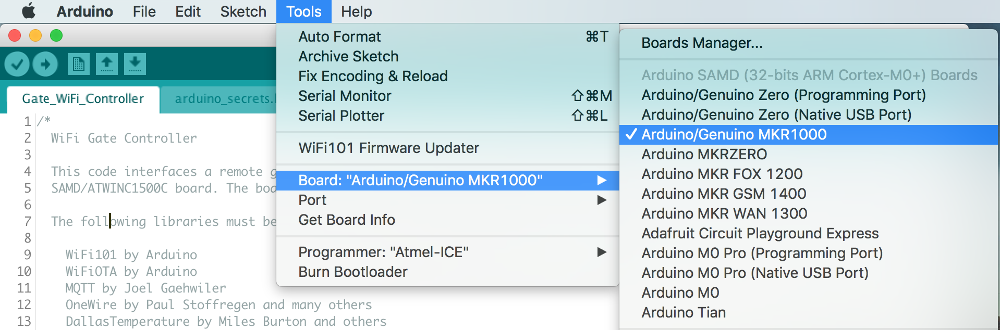
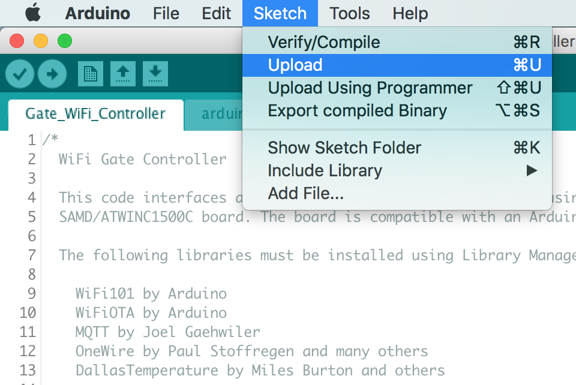

# Wireless Gate Controller
After years of using weak garage door openers and trying to position them just right so my solar powered gate 400' away would open when needed I decided it was time to make a wireless controller of my own. 802.11 is a ubiquitous choice and with the right antenna range is not a problem. Two wireless modules consistently popped up when searching for low power embedded WiFi, ESP8266 and ATWINC1500. In the end I chose the ATWINC1500 module for it's compatibility with Arduino and it's low power modes. This board is fully compatible with the Arduino MRK1000 which includes a SAMD21G18 Arm processor and the ATWINC1500 module. I also chose to use MQTT. Recent projects showed how effective the MQTT client/server model is in this situation. I use Home Assistant for home automation and it directly supports MQTT.

This board is designed for and tested with a US Automation Gate Opener.

This PCB is designed using [KiCad](http://kicad-pcb.org). Note this design is using a nightly build of KiCad NOT the current released version (4.07).

_Note: The LMZ21700 Switching Power Supply has exposed pads on the bottom which requires either a reflow oven or hot air to solder properly._

## Status
* Rev 1.0 PCB has been been ordered, assembled, and tested.
  * Order the PCB from [OSH Park](https://oshpark.com/shared_projects/rpQhhUss).
  * Order the parts from Mouser using this [Shared BOM](https://www.mouser.com/ProjectManager/ProjectDetail.aspx?AccessID=595b0bc14b).

## Board Preview

## Design
### Input Power
All components are powered by a 3.3VDC Simple Switcher from Texas Instruments ([LMZ21700](datasheets/Texas Instruments LMZ21700 Simple Switcher.pdf)). Input power is 12VDC nominal with a range of 5V-17V. The with the switching power supply efficiency at about 80% the board current draws at the lowest 5mA and an average around 12mA. Peak current during transmit is about 100mA.

### Contact Inputs
Contact inputs use a simple pullup to 5VDC and a Schmidt Trigger Inverter ([LMZ21700](datasheets/Texas Instruments SN74LVC2G14 Dual Schmitt-Trigger Inverter.pdf)). Note: software debounce is still required. A high value pullup resistor and series resistor (both 100k) were selected to reduce current levels when accidental high voltages are applied to the input. The resistor pullups should be installed where needed. If connecting to a gate controller that already has an input pulled up leave the pullup resistors off. The inputs are 5V tolerant. ESD Protection devices are included to further protect the inputs. Due to the Schmidt Trigger Inverter the software sees a logic high when a contact is closed (shorted to -V).

### Contact Outputs
There are four contact outputs on the board which short to ground (-V) when activated. The switch is an overload protected Infineon [Low-Side Automotive Switch](datasheets/Infineon BTS3800SL Smart Low-Side Switch.pdf). Each contact output has input circuitry identical to the contact inputs on the board. This allows detection of external contact closures for parallel wired contacts.

### SAMD ARM Processor and WiFi Module
The ARM processor and ATWINC1500 WiFi module are wired identical to the MKR1000 Arduino board, thus the Arduino development environment is used for software development and the ATWINC1500 module is directly supported.

## Setup
### Arduino Setup
This board is designed to mimic a [MKR1000](https://store.arduino.cc/usa/arduino-mkr1000) board from Arduino. Make sure the the MKR1000 board is supported by installing . Do this by opening the Board Manager as shown below.

Type in "samd" in the filter edit and you will see several options. Select "Arduino SAMD Boards (32-bits ARM Cortex-M0+)" and install the latest version as shown below.

It will take a few minutes to download and install the board package. Once complete it's time to install the necessary libraries. Start by opening the Library Manager as shown below.

Type in "mqtt" in the filter edit and scroll down until you see "MQTT by Joel Gaehwiler" as shown below.

Once "MQTT" is installed repeat the install for the following libraries.

* WiFi101 by Arduino
* WiFiOTA by Arduino
* OneWire by Paul Stoffregen and many others
* DallasTemperature by Miles Burton and others

### Board Setup
The Arduino development environment expects a bootloader in the SAMD ARM processor which will allow programming via USB. The bootloader must be programmed first using a supported programming pod. I used an "Atmel-ICE" pod but there are other options. First make sure you have selected the "Arduino/Genuino MKR1000" board as shown below.

Next select your programmer.

Make sure the board is powered via USB and the programmer is connected to the debug connector then select "Burn Bootloader".

Now the bootloader is programmed it's time to load the "WiFi101 FirmwareUpdater" example. This will update the firmware in the ATWINC1500 module.

Now "Upload" the "WiFi101 FirmwareUpdater" example.

Update the ATWINC1500 module by selecting "WiFi101 Firmware Updater".

Click the "Update Firmware" button.

Finally open the "Gate_WiFi_Controller.ino" sketch downloaded from GitHub. Update the necessary defines for your Wireless network and MQTT server settings see the [Code README](code/README.md) for more information. Now upload it just like the "WiFi101 FirmwareUpdater" example. All done!

# Acknowledgments
[Arduino](www.arduino.cc) kindly develops open source hardware and software which makes writing software for the board incredibly easy.
